# Cinder

[](https://github.com/superwilso/Cinder/actions/workflows/ci.yml)
[](https://github.com/superwilso/Cinder/releases/latest)
[](https://github.com/superwilso/Cinder/releases)
[](LICENSE)
[](docs/baseline_v1.4.md)

**A replacement music player for the Sony NW-A55 Walkman** (and its NW-A50-series siblings).

You install it from your computer over the USB cable, in one program, in about a minute. The player
then starts up into Cinder instead of Sony's music app. Same device, same headphone jack, same
sound — a different, faster program in front of it. If you don't like it, the same installer puts
Sony's app back.

<p align="center">
  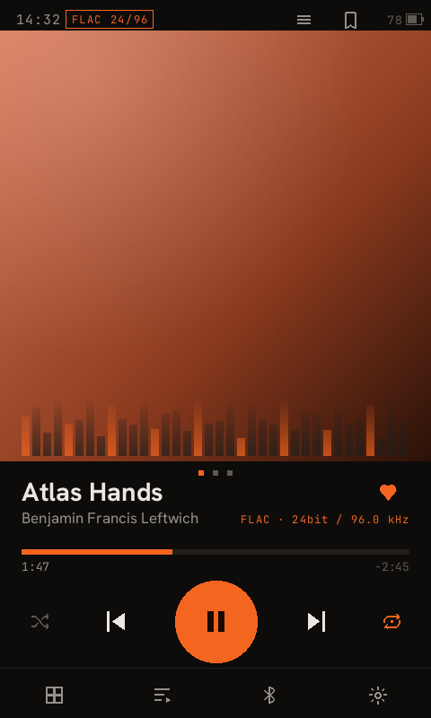
  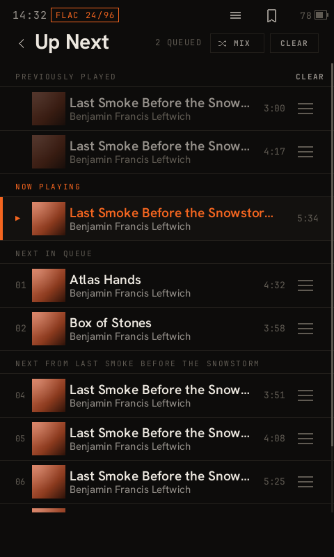
  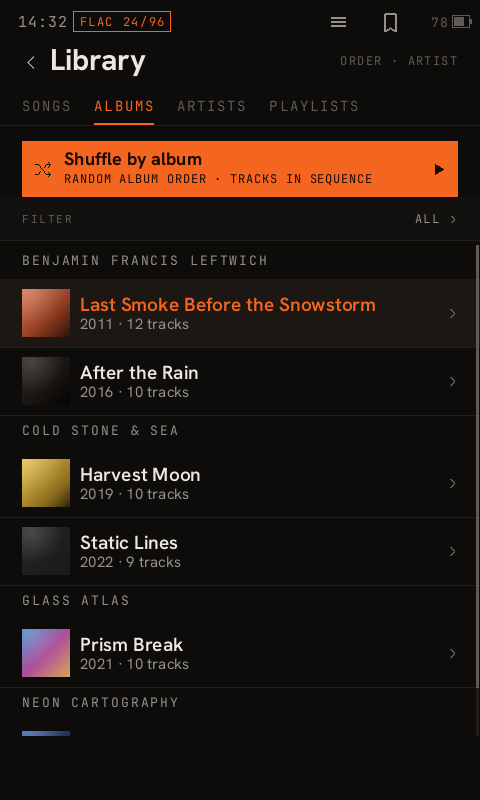
</p>

<p align="center"><sub><a href="#screenshots">More screenshots ↓</a></sub></p>

## Overveiw

| | |
|---|---|
| **What you get** | The short list is below, and the [screenshots](#screenshots) are further down. |
| **How to install it** | [Install](#install) — one download, no drivers, no WSL, nothing to build. |
| **How to undo it** | The installer's own **Uninstall** button. If the player ever won't start: [`RECOVERY.md`](RECOVERY.md). |
| **Whether it works yet** | [Status](#status), and every [`CHANGELOG.md`](CHANGELOG.md) entry says whether it has been run on real hardware. |

### What you get

- **A player that keeps up with you.** Sony's app is a Qt application on a 2016 board and it feels
  like one. Cinder is 4.4 MB of native code with no framework under it.
- **A play queue, and an Up Next list.** Stock has neither: on Sony's player there is no way to say
  "play this after the current track". Cinder has both, and you can reorder the queue by dragging.
- **USB-DAC in and LDAC out at the same time.** Use the Walkman as your computer's sound card *and*
  send that audio on to Bluetooth headphones at LDAC bitrates. Sony's app blocks that combination
  with a dialog box; the hardware never minded.
- **Every Sony sound feature, unchanged.** DSEE HX, VPT, DC Phase Linearizer, Vinyl Processor, the
  10-band EQ and tone control are Sony's own code, still running underneath. Cinder drives them; it
  does not replace them or add a layer of its own.
- **A scrobbler built in**, writing the standard `.scrobbler.log` — no add-on, no daemon.
- **FM radio with a real signal meter and a scan that takes a second**, because Cinder reads the
  tuner chip's registers directly. Sony's own service reports a constant signal strength.
- **Your own colours.** A palette is a text file you drop on the player's storage.

### What it does not touch

Your music, your playlists and your liked songs stay where they are — Cinder reads the same library
the stock player does.

It is **not a firmware replacement**, even though it is installed through the player's own
firmware-update mechanism: the kernel, Sony's audio services and the DSP are Sony's and are left
alone. What changes is which program starts. Nothing resamples your audio and nothing adds a
software mixer — playback takes the same low-power hardware path to the headphone jack that Sony's
player uses, which is also why battery life is not sacrificed for the UI.

Sony's app stays on the device, one file swap away. That is what makes uninstalling a button rather
than a rescue operation.

### A few words this README can't avoid

| | |
|---|---|
| **USB-DAC** | The player acting as a computer's external sound card, over the USB cable. |
| **LDAC** | Sony's high-bitrate Bluetooth audio codec, up to 990 kbit/s. |
| **DSEE HX** | Sony's upscaler for lossy files — it tries to restore what MP3/AAC threw away. |
| **The Home app** | The one program this device starts into and never leaves. Replacing it is what Cinder is. |
| **`.UPG`** | Sony's firmware package format. Installing Cinder hands the player one of these. |
| **setuid helper** | A tiny program allowed to do one privileged thing (reboot, mount the drive, set the clock) because the player's UI itself runs unprivileged. |

## Why

Stock firmware on this device is heavy, slow to boot, and blocks combinations the hardware is
perfectly capable of — most notably running **USB-DAC input and Bluetooth LDAC output at the
same time**, which stock refuses via a UI dialog, not a hardware limit. Cinder replaces only the
UI layer. It doesn't reimplement the audio stack: the Hagoromo services (`SoundServiceFw`,
`PlayerService`, `BtTransmitterService`, `EffectCtrlDmp`, …) are separate processes Cinder drives
over their existing binder IPC, which is what keeps EQ, DSEE HX, VPT, Vinyl and every other Sony
effect working exactly as before.

Full rationale and the living goals list: [`VISION.md`](VISION.md).

## Supported devices

Cinder is **custom firmware for the Sony NW-A50 series** — it replaces the player UI, not the
audio stack. What it has actually been built and run on:

| Model | State |
|---|---|
| **The development unit** — an NW-A50-series player with 64 GB of storage (the NW-A57's capacity; the NW-A55 is 16 GB) | **Developed and tested on — one unit.** Each [`CHANGELOG.md`](CHANGELOG.md) entry says whether it has run on this hardware (*device-verified*) or not yet (*device-unverified*). |
| **NW-A55 / NW-A56 / NW-A57** | The same `nw-a50` firmware family and MT8590 board, so expected to work — but **not tried model by model**. If you run it on one, a [device report](../../issues/new/choose) either way is genuinely useful. |
| NW-A45 / A46 / A47 (A40 series) | **Not supported.** Same SoC family, different model firmware; Cinder has never been built or tested for it. |
| NW-A35 / A36 / A37 (A30 series) | **Not supported**, same reason. |
| ZX300, WM1A / WM1Z, DMP-Z1 | **Not supported.** For these, use [Wampy](https://github.com/unknown321/wampy), which covers the whole MT8590 family. |

If you are on a device Cinder does not target, the projects under [Related
projects](#related-projects) do cover it — that list is there to send you to the right one rather
than to keep you here.

## Status

This is a real reverse-engineering project against closed firmware, built and tested on actual
hardware — one player, the developer's. Feature by feature: [`cinder-home/STATUS.md`](cinder-home/STATUS.md);
what still needs a device session: [`docs/DEVICE_CHECKLIST.md`](docs/DEVICE_CHECKLIST.md). Every
[`CHANGELOG.md`](CHANGELOG.md) entry says whether it has run on hardware.

In daily use: playback through Sony's full effects chain, the library, the queue and Up Next,
playlists, Bluetooth pairing and playback (LDAC, aptX HD, aptX and SBC), FM radio, a built-in
scrobbler log, and an escape ladder back to the stock player.

**The headline works.** USB-DAC input out over LDAC ran end to end on the development unit on
2026-09-12 — the whole path, from a PC over the cable to headphones on LDAC. That run is recorded
as *owner-reported*: it worked, and no log was captured, so
[`docs/DEVICE_CHECKLIST.md`](docs/DEVICE_CHECKLIST.md) says exactly that rather than claiming an
artefact that does not exist.

### Known limitations

- **One test unit.** Other NW-A50-series models share its firmware and are expected to work; none
  has been tried.
- **Not implemented yet:** Bluetooth receiver mode (the Walkman as a Bluetooth speaker), lyrics,
  search across the whole library (search exists only when adding songs to a playlist), and FM
  recording.
- **Boot time and battery life are unmeasured against stock.** Cinder draws its first frame 13.2 s
  after the kernel starts; stock has not been timed on the same unit, and there is no battery-drain
  figure yet. "Faster and longer-lasting" is the goal, not a measurement — when there are numbers
  they will be here.
- **The Windows install path is new and has never been run on Windows.** From 0.3.1 the installer
  sends the player's upgrade command itself instead of launching Sony's updater
  ([details](#what-actually-writes-the-firmware)). It compiles and the same command has been sent
  from Linux for months; it has not yet been sent from Windows. If it fails it fails safely — the
  files are staged and verified first, and the installer tells you which step did not happen.
- **The Windows installer is unsigned**, and now asks for administrator — see [Install](#install).

## Install

Download **`cinder-installer-windows-x64.exe`** from the [latest
release](../../releases/latest), connect the Walkman by USB in mass-storage mode, and run it.

| You are on | Download | What it does |
|---|---|---|
| **Windows** | `cinder-installer-windows-x64.exe` | The whole job. Double-click for the window. **Say yes to the administrator prompt** — the last step needs raw access to the player's drive, and Windows gives that to nothing less. |
| **Linux** | `cinder-installer-linux-x64` | The whole job, from the terminal — **run it with `sudo`**. The last step is a raw SCSI passthrough, which is why it needs root. |
| **macOS** | `cinder-installer-linux-x64` is not for you | It can stage the files but cannot finish; see below. Use a Linux or Windows machine. |
| Recovering a device | `cinder-home-uninstall.upg` | Flash by hand when the player will not boot far enough for anything else. [`RECOVERY.md`](RECOVERY.md). |

The installer carries everything it needs. There is **no separate download, no WSL, no usbipd, no
driver setup, and no network connection required** — the device binaries, both firmware packages and
the component catalogue are all inside the one file. Nothing of Sony's is: until 0.3.1 the Windows
build embedded Sony's own updater, and it now sends the one command that needed itself.

The `.exe` is **unsigned**, so Windows SmartScreen will warn that its publisher is unknown. That is
what any unsigned binary gets and is not evidence either way — check the download against the
`SHA256SUMS` attached to the release; the release notes give the one-line command for Windows and
Linux.

### The three things it does

```
┌────────────────────────────────────────────────────────────────┐
│  Cinder                                       0.3.1 · stable   │
├────────────────────────────────────────────────────────────────┤
│   Player:  D:\                                    [ Rescan ]   │
│   Cinder is installed (installer 0.3.0, stable) — Thu Sep 11    │
│                                                                 │
│   ┌──────────────────────────────────────────────────────────┐ │
│   │ Install Cinder                                           │ │
│   │ Fresh install: choose the optional parts, then flash.    │ │
│   ├──────────────────────────────────────────────────────────┤ │
│   │ Update Cinder                                            │ │
│   │ Same components as last time, new build.                 │ │
│   ├──────────────────────────────────────────────────────────┤ │
│   │ Uninstall                                                │ │
│   │ Put the stock Sony player back.                          │ │
│   └──────────────────────────────────────────────────────────┘ │
│                                                                 │
│   [ Check for a newer release ]   [ Clean up 11 staged files ] │
└────────────────────────────────────────────────────────────────┘
```

**Install** asks which optional parts you want, then stages them. **Update** reads the choices
already on the player out of its own `cinder_components.conf` and keeps them, so a new build never
silently resets your settings. **Uninstall** restores Sony's launch config from the backup the
install made and removes Cinder's binaries — your music, playlists and settings are untouched.

The window reads the player's state from the device's own install log before offering anything, so
it says what is actually on the player rather than guessing: whether Cinder is there, which
version put it there, and whether the last attempt succeeded, was reverted by the device's sanity
gate, or never finished.

Everything is available from the command line too — `--install`, `--update`, `--uninstall`,
`--clean`, `--check`, `-y` — and running the same binary from a terminal gives the text interface
instead of the window, which is what works over RDP, in a VM and from a script.

### Choosing components

You can leave parts of Cinder out, and the picker explains each one — but only the parts that are
genuinely a matter of taste. **There are five choices:** the FM register helper (a real signal meter
and a one-second band scan), the charger-detail reader on the battery screen, an experimental GPU
path that is off by default and measures slower than the software one, the wired volume curve, and
the sound signature below.

Until 0.3.1 the same picker also offered to leave out the power menu, USB file transfer and the
clock, each with help text admitting the feature was gone without it. Those were not choices, and
they are part of every install now. The four helpers behind them are 60 KB together.

The `signature` option patches **three bytes** of Sony's audio HAL to pick which DAC path the
output stream uses and what CPU clock floor is held while playing. That is the entirety of what
Walkman One's paid "sound signature" does; Cinder reproduces its variants byte-for-byte from your
own stock library with **no firmware flash**, and adds three combinations Walkman One doesn't
ship, splitting its two effects apart so each can be judged separately. Derivation:
[`analysis/RE_walkmanone_extract.md`](analysis/RE_walkmanone_extract.md).

### What actually writes the firmware

Not the installer. It only copies files to the player's storage and then sends the one command
that makes the player reboot into **its own updater**, which finds `NW_WM_FW.UPG` and applies it.
The installer sends that 12-byte vendor SCSI command itself on both platforms — through SCSI
pass-through on Windows (which needs administrator, because Windows grants raw volume access only
to an elevated process) and through `SG_IO` on Linux (which needs `sudo`). Until 0.3.1 the Windows
build shipped Sony's own `SoftwareUpdateTool.exe` to send it; no part of Sony's software is in the
download any more.

> **There is no update option in the player's own menus.** This generation has no such entry — the
> upgrade is always triggered by the host over USB. Earlier versions of this README and of the
> installer told you to find **Settings ▸ Device Settings ▸ Update** on the device. That menu does
> not exist, and the Linux binary refused to start at all, so neither path installed anything. Both
> were fixed in v0.1.9.

**On macOS the installer stages but cannot finish.** The upgrade command is a vendor SCSI
passthrough, and macOS only exposes those through an IOKit `SCSITaskUserClient`, which the kernel
will not grant for a disk it has already mounted — the exact state a staged Walkman is in. Finish
from a Linux or Windows machine.

Full walkthrough, every component explained, and the developer build:
**[`install.md`](install.md)**. Removing Cinder: **[`UNINSTALL.md`](UNINSTALL.md)**. If a boot ever
goes wrong: **[`RECOVERY.md`](RECOVERY.md)** — read it before you need it.

## Repo layout

| Path | What it is |
|---|---|
| `cinder-home/` | The C++ easel app — lifecycle, watchdogs, Sony-IPC glue, the LDAC bridge, `cinder-probe` (a no-boot-risk diagnostic binary) |
| `player/cinder-ui/` | The Rust UI — pure render + navigation state machine, no I/O |
| `player/cinder-ffi/` | The Rust↔C++ boundary: render tick, input, scrobbler, SQLite |
| `player/cinder-host/`, `player/cinder-sim/` | Host-side dev tools — render every screen to PNG, or drive the real navigator in a window, without a device |
| `installer/` | The end-user installer — install, update, uninstall; a Win32 GUI and a text interface over one core. Dependency-free Rust, embeds the device binaries, both `.UPG` packages and the component catalogue, ships as a single `.exe` |
| `ldac-bridge/` | Standalone LDAC transmit research binary (superseded by the bridge now built into `cinder-home`, kept for the RE trail) |
| `analysis/` | Reverse-engineering findings — per-subsystem `RE_findings.md`, the extracted UI asset catalogue, IPC vtable maps |
| `docs/`, `phases/` | The host-side firmware-analysis pipeline (`make phase1`…`phase7`) and its output docs |
| `design/` | UI design references and handoff notes |

`CLAUDE.md` is the full environment setup + host pipeline + device procedure writeup — it
doubles as onboarding for a human contributor even though it was written for an AI pair.

## Building

```bash
cinder-home/build.sh dev      # or: stable — two channels from one tree
```

Needs a glibc-2.23 + libc++-3.9.0 cross toolchain matching the device's own runtime; `build.sh`
checks for both and exits with what's missing. Full environment setup (WSL2, cross-compilers,
the firmware-analysis pipeline): [`CLAUDE.md`](CLAUDE.md) Parts A–D.

To iterate on the UI without a device at all:

```bash
cd player && cargo build --release -p cinder-host   # renders every screen to PNG
# or drive it live:
cargo build --release -p cinder-sim --bin device     # 480x800 window, real navigator + input
```

To build the end-user installer (embeds whatever is in `cinder-home/dist/<channel>/`):

```bash
cd installer
CINDER_CHANNEL=stable cargo build --release                                  # native
CINDER_CHANNEL=stable cargo build --release --target x86_64-pc-windows-gnu   # .exe, from Linux
```

Releases are cut by `.github/workflows/release.yml` on a `v*` tag. It builds only the installer —
the ARM binaries under `cinder-home/dist/` are committed, so **build and commit `dist/` before
tagging**. See [`install.md`](install.md) for the whole pipeline and how to add a component.

## Cutting a release

Releases are automated, but with one hand-built step that cannot be automated away: the ARM
binaries. Building `cinder-home` needs a glibc-2.23 + libc++-3.9.0 cross toolchain matched to the
player's own runtime, so they are built by a maintainer and **committed** under
`cinder-home/dist/`. Only the installer is built in CI.

That split has exactly one dangerous failure mode — tagging a commit whose `dist/` is stale, which
ships an installer full of last week's binaries with a green tick and no warning. `tools/release.sh`
exists to make that impossible:

```sh
tools/release.sh v1.2.3 --dry-run   # verify everything, touch nothing
tools/release.sh v1.2.3             # verify, tag, push
```

It refuses to tag unless the tree is clean, `installer/Cargo.toml`'s version matches the tag, every
embedded payload file exists, **a fresh `build.sh stable` reproduces the committed `dist/` byte for
byte**, and the installer's own tests pass. It never commits anything — staging stays yours.

Pushing the tag is what triggers `.github/workflows/release.yml`, which builds the Windows and
Linux installers, attaches them plus the two `.upg` files and `SHA256SUMS` to a **published** (not
draft) GitHub release, and marks it pre-release if the tag has a suffix like `-rc1`.

Every other push runs `.github/workflows/ci.yml`, which builds and tests the player and the
installer on both platforms and checks the committed payload is complete and actually ARM — so a
tag is a formality rather than the first time anything gets compiled for Windows.

## Flashing and recovery

**Read [`RECOVERY.md`](RECOVERY.md) before flashing anything.** This device has no public
DFU/EDL recovery path — a bad flash means a full `wbrt` eMMC restore. The project's safety model
(bad-boot counter, crash supervisor, an escape ladder ordered so each rung depends on strictly
less than the one it rescues) exists because of a real brick during development, documented
there. `cinder-home/STATUS.md` STEP 1 is the zero-risk way to test a build before ever flashing
it as the Home app.

## Documentation

[`docs/README.md`](docs/README.md) is the index — it says which document answers which question,
and which ones are history rather than current state.

The four that are always current:

| | |
|---|---|
| [`RECOVERY.md`](RECOVERY.md) | **Read before flashing.** No public DFU or EDL path exists for this device. |
| [`cinder-home/STATUS.md`](cinder-home/STATUS.md) | The feature matrix — current state, kept current rather than aspirational. |
| [`docs/DEVICE_CHECKLIST.md`](docs/DEVICE_CHECKLIST.md) | The run sheet for anything that needs the player in your hand. |
| [`CHANGELOG.md`](CHANGELOG.md) | What changed in each release, and whether it was verified on hardware. |

## Related projects

Cinder exists because these did the groundwork, and each of them is the right answer to a question
Cinder is the wrong answer to:

| | |
|---|---|
| [**Wampy**](https://github.com/unknown321/wampy) (unknown321) | A skinnable replacement UI across the whole MT8590 Walkman family — A30/A40/A50, ZX300, WM1A/Z, DMP-Z1. Broader device support than Cinder by a long way, and its `MAKING_OF` write-ups are the map this platform was first charted with. |
| [**wbrt**](https://github.com/unknown321/wbrt) (unknown321) | Full eMMC backup and restore over the MediaTek VCOM port. **The brick insurance for every project on this list** — including this one. |
| [**Walkman One**](https://www.mrwalkman.com/) (MrWalkman) | Modified stock firmware: Sony's own player with the region and feature locks removed. If you want stock-but-unlocked rather than a different player, this is it. |
| [**Rockbox `nwztools`**](https://github.com/Rockbox/rockbox/tree/master/utils/nwztools) | The `.UPG` pack/unpack tooling, per-model KAS keys and the NVP slot map that make any of this reachable. |
| [**scrobbler**](https://github.com/unknown321/scrobbler) (unknown321) | Last.fm scrobbling on-device; Cinder writes the same `.scrobbler.log` format. |

## Contributing

Issues and PRs welcome — this covers everything from firmware RE to UI work to just testing on
your own device. Start with [`CONTRIBUTING.md`](CONTRIBUTING.md), which has the local check
commands and the safety rules for anything that runs as root or touches the boot path.

**The single most useful contribution is a device report.** A large part of this project is
code-complete and unverified on hardware; if you own an A50-series player, running one line from
[`docs/DEVICE_CHECKLIST.md`](docs/DEVICE_CHECKLIST.md) and filing the result — pass *or* fail —
moves things that no amount of desk work can.

`analysis/` is the research trail; if you're picking up an open question there, that's the place
to start. [`docs/AUDIT_2026-09-01.md`](docs/AUDIT_2026-09-01.md) Part D is the current list of open
decisions.

By participating you agree to the [Code of Conduct](CODE_OF_CONDUCT.md).

---

## Screenshots

Every shot is a real render of the shipping UI at the device's native 480×800, produced by the
`cinder-host` preview harness (`cargo run -p cinder-host`) rather than a mockup. Cover art is
generated placeholder gradients — the harness has no library of its own, and using real album art
here would be someone else's copyright.

### Playing

| Now playing | Up Next | Reordering | Volume |
|---|---|---|---|
|  |  | 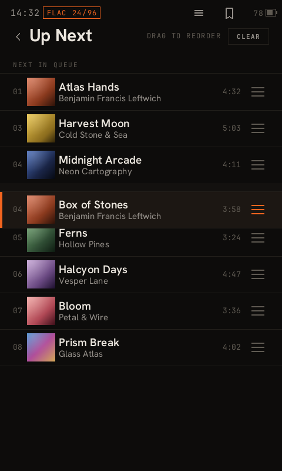 | 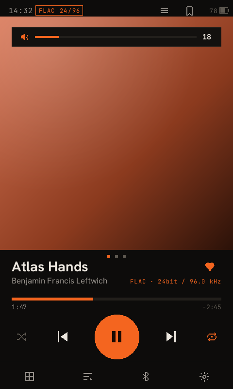 |

The queue is one list: history, the playing track, your hand-picked queue, and the rest of the
album it came from. Any row below the playing one can be dragged by its handle — including the
`NEXT FROM` section, so you can rearrange the album you're already listening to without
interrupting it.

### Library

| Albums | Songs | Artists | Playlists |
|---|---|---|---|
|  | 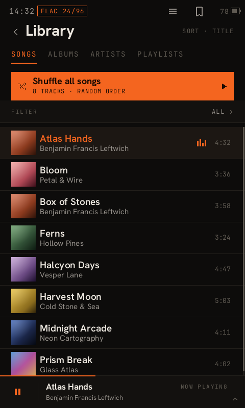 | 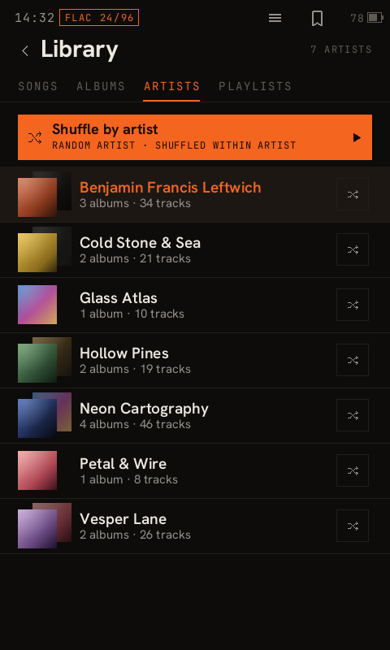 | 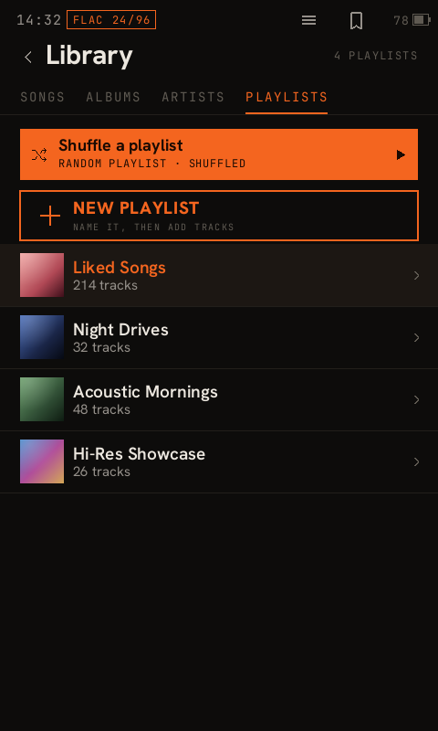 |

| Album | Artist | Folders | Track info |
|---|---|---|---|
| 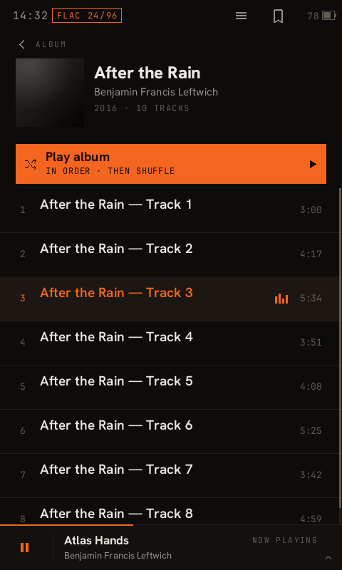 | 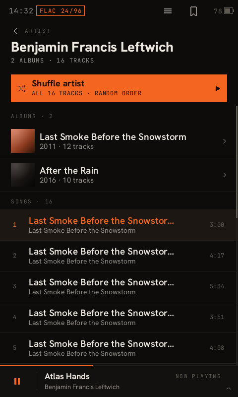 | 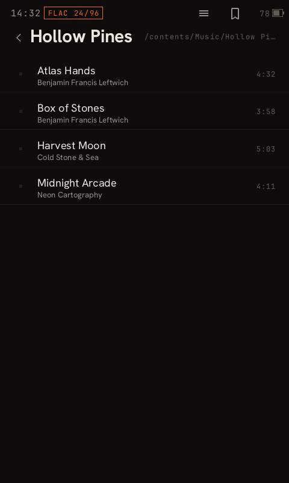 | 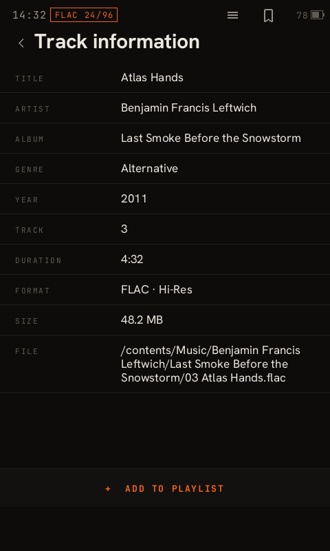 |

### Sound

| Equalizer | Sony DSP | Bluetooth | USB-DAC |
|---|---|---|---|
| 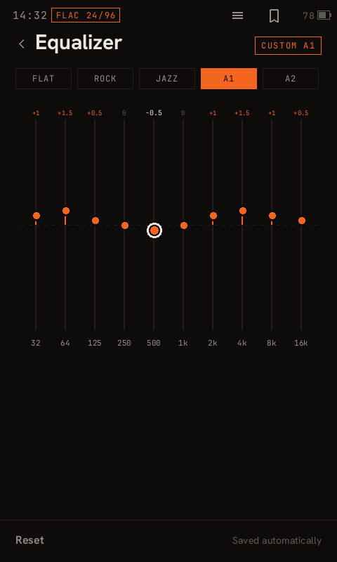 | 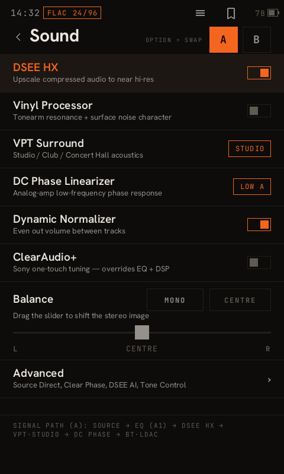 | 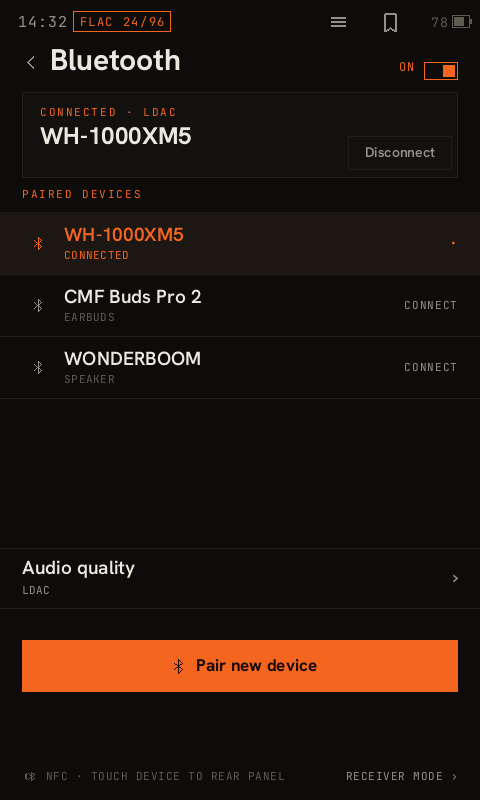 | 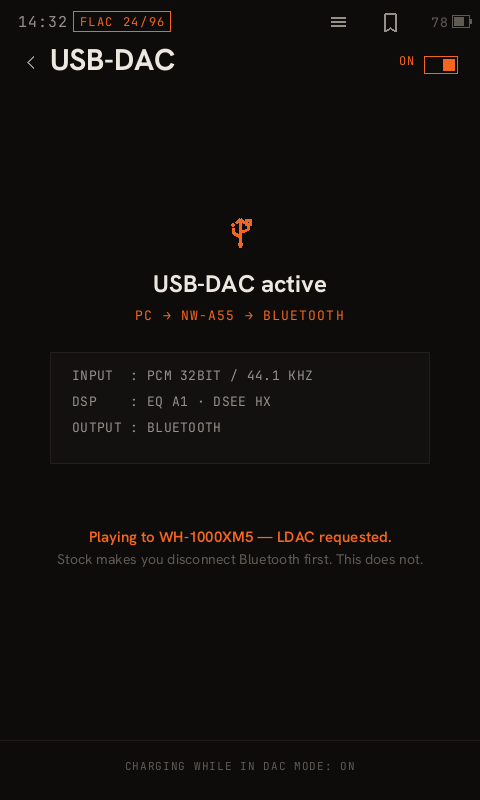 |

`Sound` drives Sony's own effect services, so DSEE HX, VPT, DC Phase Linearizer, Vinyl Processor
and the rest behave exactly as they do on stock — the footer prints the resulting signal path.

### The rest

| Settings | Shelf | Lock screen | FM radio |
|---|---|---|---|
| 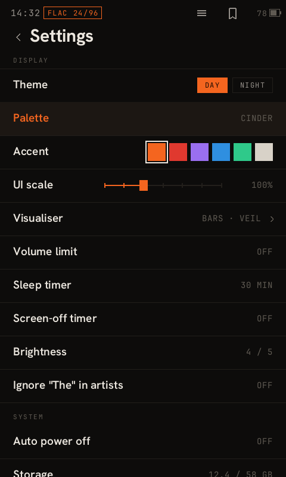 | 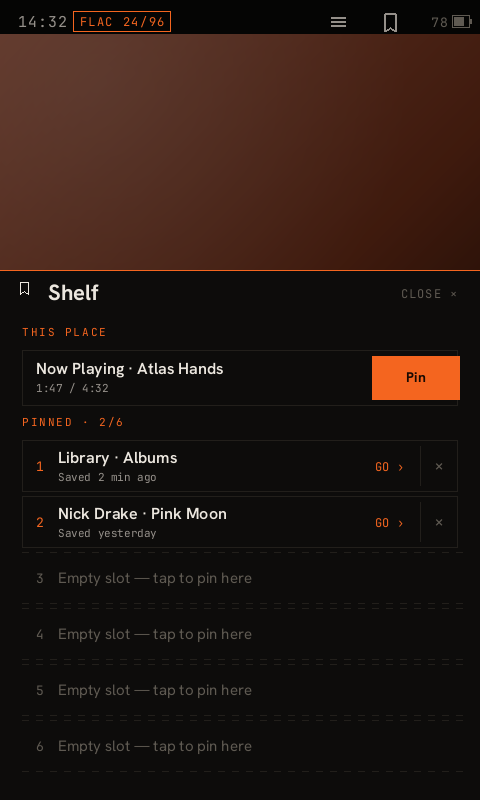 | 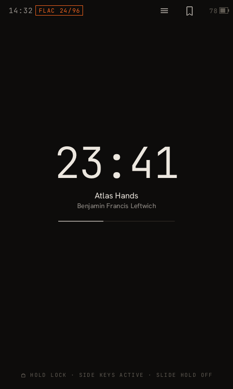 | 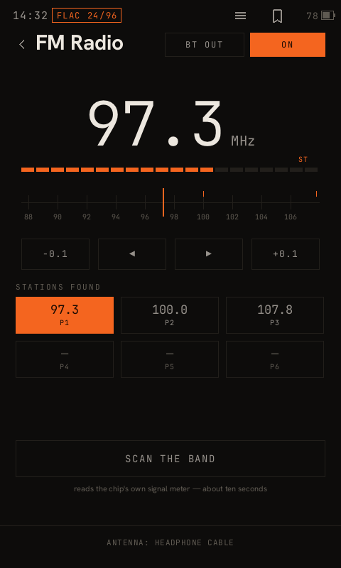 |

### Visualisers and themes

| Bars | Ribbon | Night — playing | Night — library |
|---|---|---|---|
| 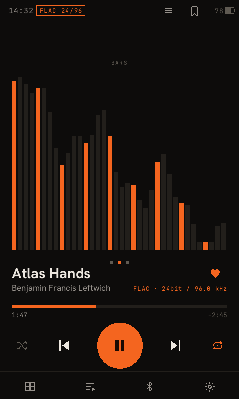 | 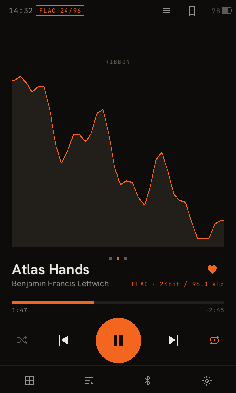 | 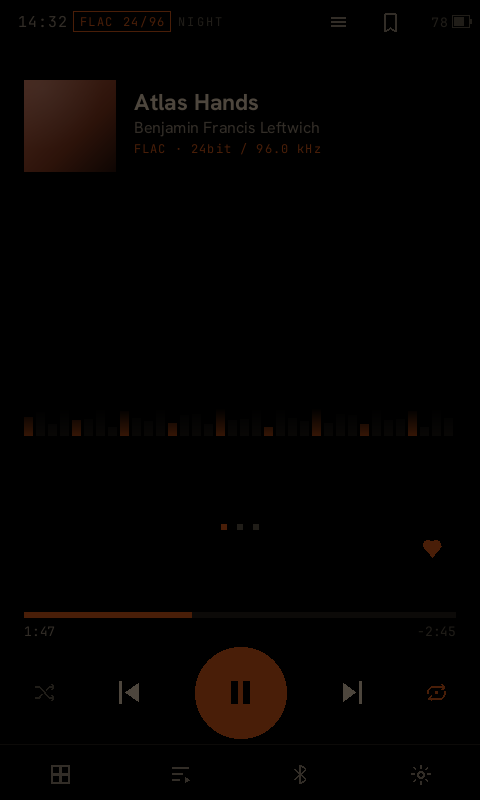 | 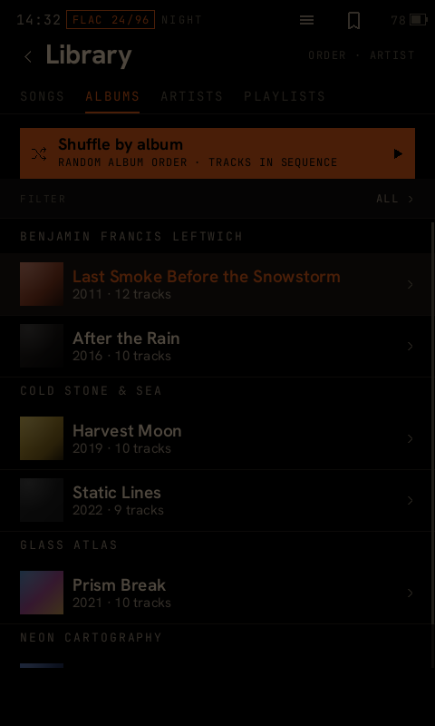 |

Eight visualisers, six accent colours, and a **night theme that is genuinely dim** — it is meant
for a dark room at low brightness, which is why it looks nearly black next to the day theme rather
than merely dark-grey.

## License

Cinder's own code (`cinder-home/`, `player/`, `ldac-bridge/`, `tools/`) is MIT — see
[`LICENSE`](LICENSE).

**Third-party / not ours:** nothing, as of 0.3.1. The Windows installer used to embed
**Sony's own firmware updater** (`installer/sony-updater/`: `SoftwareUpdateTool.exe`, Sony's
`WmFwUpdater.dll` and Microsoft's Visual C++ 2010 runtime) to perform the USB handoff; the
installer now sends that one vendor SCSI command itself on Windows as it already did on Linux, and
the bundle is gone from the tree and from every release. The tree holds no Sony code
or artwork: the reverse-engineering notes describe interfaces — symbol names, vtable slots, call
sequences — and the images, QML and decompiled listings they were worked out from are kept out of
the repository. Bundled fonts (`player/cinder-ui/assets/fonts/`) are SIL Open Font License 1.1 —
see the `*-OFL.txt` next to each family. `analysis/`'s pipeline references the Rockbox project
(`nwztools`, GPL) for `.UPG` packing/unpacking and per-model firmware keys; that tooling is used
as an external build dependency, not vendored into this repo.

This project is not affiliated with or endorsed by Sony. "Walkman" and related marks belong to
Sony Corporation.

As a disclaimer, a large amount of the reverse engineering work, documentation and rust and C++ code were writen by claude.
All work was supervised and checked by a human.