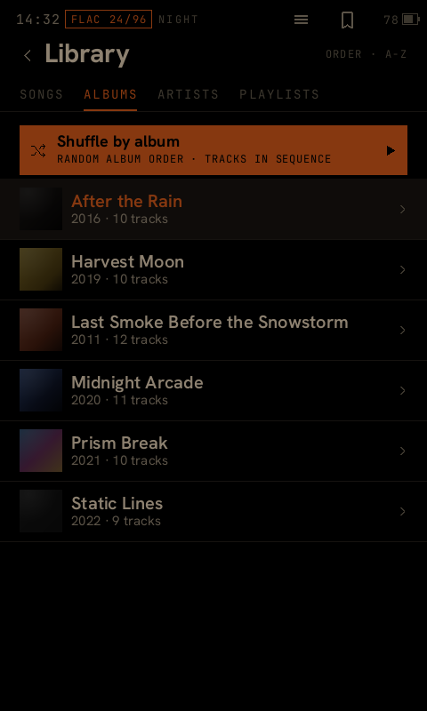

# Cinder

A from-scratch replacement Home app for the Sony NW-A55/A50 Walkman — native, ~3 MB, running
in place of Sony's stock Qt player while keeping every one of Sony's audio services (DSP,
codecs, LDAC) intact underneath it.

<p align="center">
  
  
</p>

## Why

Stock firmware on this device is heavy, slow to boot, and blocks combinations the hardware is
perfectly capable of — most notably running **USB-DAC input and Bluetooth LDAC output at the
same time**, which stock refuses via a UI dialog, not a hardware limit. Cinder replaces only the
UI layer. It doesn't reimplement the audio stack: the Hagoromo services (`SoundServiceFw`,
`PlayerService`, `BtTransmitterService`, `EffectCtrlDmp`, …) are separate processes Cinder drives
over their existing binder IPC, which is what keeps EQ, DSEE HX, VPT, Vinyl and every other Sony
effect working exactly as before.

Full rationale and the living goals list: [`VISION.md`](VISION.md).

## Status

This is a real reverse-engineering project against closed firmware, built and tested on actual
hardware, not a simulator. Current state, feature-by-feature: [`cinder-home/STATUS.md`](cinder-home/STATUS.md).
Forward plan: [`cinder-home/ROADMAP.md`](cinder-home/ROADMAP.md).

Headline feature (USB-DAC → LDAC bridge) is proven on hardware. Bluetooth pairing/playback,
NFC tap-to-pair, and the rest of the UI are daily-usable with a handful of items still
device-gated — see STATUS.md for the exact matrix, it's kept current rather than aspirational.

## Install

Download **`cinder-installer-windows-x64.exe`** from the [latest release](../../releases/latest),
plug the Walkman in over USB in mass-storage mode, and run it. It finds the player, asks which
optional parts you want, copies them across, and tells you what to do next. There's a Linux build
too.

```
  Cinder installer  (channel: stable)
  player: D:\
  ------------------------------------------------------------
    1  [x]     Power off / Restart menu                   power
    2  [x]     USB mass storage (put music on the device) msc
    3  [x]     Set the clock and RTC                      clock
    4  [x]     Unmount helper for USB mass storage        umount
    5  [ ]     GPU present path (experimental, dev only)  gpunode
    6  <stock> Audio "sound signature"                    signature
  ------------------------------------------------------------
   <number> toggle/cycle   ?<number> describe   i install   q quit
```

Cinder is modular on purpose. Four of its parts are small setuid-root helpers, each buying one
specific feature (power off, USB mass storage, setting the clock) with one specific piece of
attack surface — so each is a choice rather than an assumption, and the descriptions in the picker
say what saying no actually costs you.

The `signature` option patches **three bytes** of Sony's audio HAL to pick which DAC path the
output stream uses and what CPU clock floor is held while playing. That is the entirety of what
Walkman One's paid "sound signature" does; Cinder reproduces its variants byte-for-byte from your
own stock library with **no firmware flash**, and adds three combinations Walkman One doesn't
ship, splitting its two effects apart so each can be judged separately. Derivation:
[`analysis/RE_walkmanone_extract.md`](analysis/RE_walkmanone_extract.md).

The installer only copies files — the firmware write is done by the player's own updater
afterwards. Full walkthrough, every component explained, and the developer build:
**[`install.md`](install.md)**.

## Repo layout

| Path | What it is |
|---|---|
| `cinder-home/` | The C++ easel app — lifecycle, watchdogs, Sony-IPC glue, the LDAC bridge, `cinder-probe` (a no-boot-risk diagnostic binary) |
| `player/cinder-ui/` | The Rust UI — pure render + navigation state machine, no I/O |
| `player/cinder-ffi/` | The Rust↔C++ boundary: render tick, input, scrobbler, SQLite |
| `player/cinder-host/`, `player/cinder-sim/` | Host-side dev tools — render every screen to PNG, or drive the real navigator in a window, without a device |
| `installer/` | The end-user installer — dependency-free Rust, embeds the device binaries and the component catalogue, ships as a single `.exe` |
| `ldac-bridge/` | Standalone LDAC transmit research binary (superseded by the bridge now built into `cinder-home`, kept for the RE trail) |
| `analysis/` | Reverse-engineering findings — per-subsystem `RE_findings.md`, the extracted UI asset catalogue, IPC vtable maps |
| `docs/`, `phases/` | The host-side firmware-analysis pipeline (`make phase1`…`phase7`) and its output docs |
| `design/` | UI design references and handoff notes |

`CLAUDE.md` is the full environment setup + host pipeline + device procedure writeup — it
doubles as onboarding for a human contributor even though it was written for an AI pair.

## Building

```bash
cinder-home/build.sh dev      # or: stable — two channels from one tree
```

Needs a glibc-2.23 + libc++-3.9.0 cross toolchain matching the device's own runtime; `build.sh`
checks for both and exits with what's missing. Full environment setup (WSL2, cross-compilers,
the firmware-analysis pipeline): [`CLAUDE.md`](CLAUDE.md) Parts A–D.

To iterate on the UI without a device at all:

```bash
cd player && cargo build --release -p cinder-host   # renders every screen to PNG
# or drive it live:
cargo build --release -p cinder-sim --bin device     # 480x800 window, real navigator + input
```

To build the end-user installer (embeds whatever is in `cinder-home/dist/<channel>/`):

```bash
cd installer
CINDER_CHANNEL=stable cargo build --release                                  # native
CINDER_CHANNEL=stable cargo build --release --target x86_64-pc-windows-gnu   # .exe, from Linux
```

Releases are cut by `.github/workflows/release.yml` on a `v*` tag. It builds only the installer —
the ARM binaries under `cinder-home/dist/` are committed, so **build and commit `dist/` before
tagging**. See [`install.md`](install.md) for the whole pipeline and how to add a component.

## Flashing and recovery

**Read [`RECOVERY.md`](RECOVERY.md) before flashing anything.** This device has no public
DFU/EDL recovery path — a bad flash means a full `wbrt` eMMC restore. The project's safety model
(bad-boot counter, crash supervisor, an escape ladder ordered so each rung depends on strictly
less than the one it rescues) exists because of a real brick during development, documented
there. `cinder-home/STATUS.md` STEP 1 is the zero-risk way to test a build before ever flashing
it as the Home app.

## Contributing

Issues and PRs welcome — this covers everything from firmware RE to UI work to just testing on
your own device. `analysis/` is the research trail; if you're picking up an open question there,
that's the place to start. `cinder-home/ROADMAP.md` has the current prioritized backlog.

## License

Cinder's own code (`cinder-home/`, `player/`, `ldac-bridge/`, `tools/`) is MIT — see
[`LICENSE`](LICENSE).

**Third-party / not ours:** `analysis/ui_assets/` contains UI graphics extracted directly from
Sony's stock firmware for reference during development — that's Sony's copyrighted art, kept here
as research material, not covered by this project's license, and not an original contribution of
this project. Bundled fonts (`player/cinder-ui/assets/fonts/`) are SIL Open Font License 1.1 —
see the `*-OFL.txt` next to each family. `analysis/`'s pipeline references the Rockbox project
(`nwztools`, GPL) for `.UPG` packing/unpacking and per-model firmware keys; that tooling is used
as an external build dependency, not vendored into this repo.

This project is not affiliated with or endorsed by Sony. "Walkman" and related marks belong to
Sony Corporation.
